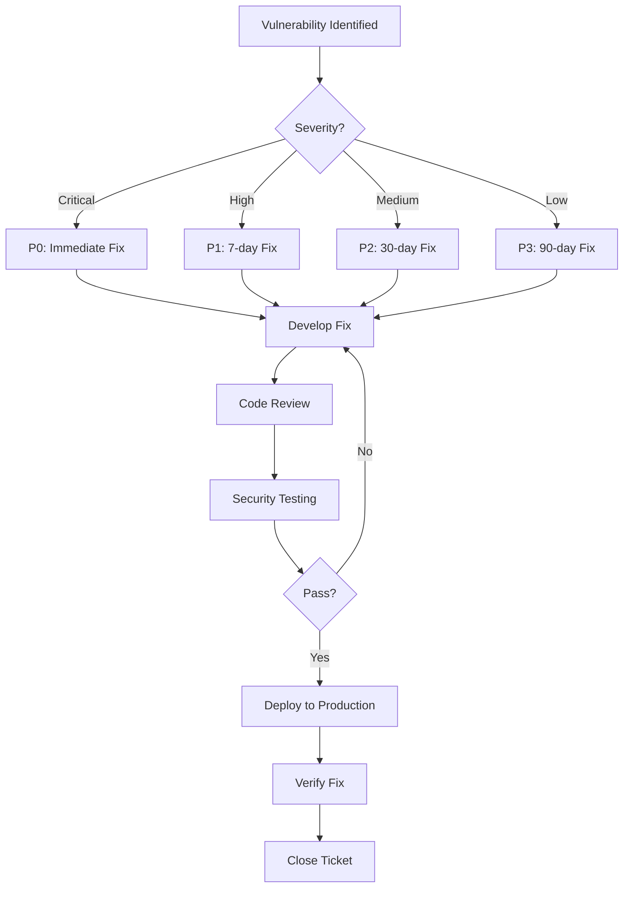

# Penetration Testing Preparation - Q2 2026

## Overview

This document outlines the preparation, scope, and procedures for penetration testing of the ALPHA Interface GUI platform, scheduled for Q2 2026.

---

## Table of Contents

1. [Testing Objectives](#testing-objectives)
2. [Scope Definition](#scope-definition)
3. [Testing Methodology](#testing-methodology)
4. [Pre-Test Preparation](#pre-test-preparation)
5. [Security Baseline Assessment](#security-baseline-assessment)
6. [Vulnerability Assessment Tools](#vulnerability-assessment-tools)
7. [Remediation Process](#remediation-process)
8. [Post-Test Activities](#post-test-activities)

---

## Testing Objectives

### Primary Objectives

1. **Identify Security Vulnerabilities**: Discover exploitable weaknesses before attackers do
2. **Validate Security Controls**: Test effectiveness of implemented security measures
3. **Compliance Verification**: Ensure GDPR, NIS2, and industry standards compliance
4. **Risk Assessment**: Quantify security risks and prioritize remediation
5. **Incident Response Testing**: Evaluate detection and response capabilities

### Success Criteria

- ✅ No critical vulnerabilities remain unmitigated post-test
- ✅ All high-severity findings remediated within 30 days
- ✅ Comprehensive remediation plan for medium/low findings
- ✅ Security controls validated and documented
- ✅ Executive summary report delivered to management

---

## Scope Definition

### In-Scope Systems

| System | URL/IP | Description | Criticality |
|--------|--------|-------------|-------------|
| Production Website | https://blackbox.codes | Public-facing website | Critical |
| Contact Form API | https://blackbox.codes/contact-submit.php | Form processing endpoint | High |
| Admin Panel | https://blackbox.codes/admin.php | Administrative interface | Critical |
| Agent Dashboard | https://blackbox.codes/dashboard.php | User dashboard | High |
| API Endpoints | https://blackbox.codes/api/* | REST API | High |
| Database Server | 10.0.1.10 (internal) | MySQL database | Critical |

### Testing Types

#### 1. External Penetration Testing (Black Box)

**Scope:**
- Public-facing web application
- Exposed APIs
- Network perimeter
- DNS and domain security

**Methodology:**
- No prior knowledge provided
- Simulates external attacker perspective
- Focus on reconnaissance and exploitation

#### 2. Internal Penetration Testing (Gray Box)

**Scope:**
- Internal network access (VPN credentials provided)
- Database server
- Internal APIs
- File storage

**Methodology:**
- Limited credentials provided (standard user account)
- Simulates malicious insider or compromised account
- Focus on lateral movement and privilege escalation

#### 3. Web Application Testing (White Box)

**Scope:**
- Complete application source code
- Authentication mechanisms
- Session management
- Input validation
- Business logic

**Methodology:**
- Full access to source code and documentation
- Code review + dynamic testing
- Focus on logic flaws and crypto weaknesses

### Out-of-Scope

❌ **Social Engineering**: No phishing or pretexting attacks  
❌ **Physical Security**: No physical break-in attempts  
❌ **DoS/DDoS**: No availability attacks that could disrupt service  
❌ **Third-Party Services**: Cloudflare, GitHub, Proton Mail (managed externally)  
❌ **Production Data Manipulation**: No modification or deletion of real data

---

## Testing Methodology

### OWASP Testing Framework

Following **OWASP Testing Guide v4** and **OWASP Top 10 2021**:

#### 1. Information Gathering (OWASP-IG)

```bash
# DNS enumeration
dig blackbox.codes ANY
nslookup -type=TXT blackbox.codes

# Subdomain discovery
amass enum -d blackbox.codes
subfinder -d blackbox.codes

# Technology fingerprinting
whatweb https://blackbox.codes
wappalyzer --url https://blackbox.codes

# Directory/file discovery
ffuf -w /usr/share/wordlists/dirb/common.txt -u https://blackbox.codes/FUZZ
```

#### 2. Configuration Testing (OWASP-CM)

```bash
# SSL/TLS testing
testssl.sh https://blackbox.codes
sslscan blackbox.codes

# Security headers
curl -I https://blackbox.codes | grep -E "(X-Frame-Options|Content-Security-Policy|Strict-Transport-Security)"

# HTTP methods testing
curl -X OPTIONS https://blackbox.codes -v
curl -X TRACE https://blackbox.codes -v
```

#### 3. Authentication Testing (OWASP-AT)

**Tests:**
- Weak password policy
- Credential stuffing
- Brute force attacks
- Session fixation
- Insecure password recovery
- Multi-factor authentication bypass

```bash
# Brute force testing (controlled, rate-limited)
hydra -l admin -P /usr/share/wordlists/rockyou.txt https-post-form "blackbox.codes:login.php:username=^USER^&password=^PASS^:F=incorrect"

# Session testing
# Test session timeout, secure flag, httponly flag
```

#### 4. Authorization Testing (OWASP-AZ)

**Tests:**
- Privilege escalation (horizontal and vertical)
- Insecure direct object references (IDOR)
- Missing function-level access control
- Path traversal

```bash
# IDOR testing
# Try accessing /admin.php?user_id=1 as user_id=2
curl -b "session=USER2_SESSION" "https://blackbox.codes/admin.php?user_id=1"

# Path traversal
curl "https://blackbox.codes/download.php?file=../../../../etc/passwd"
```

#### 5. Input Validation Testing (OWASP-IN)

**Tests:**
- SQL Injection (SQLi)
- Cross-Site Scripting (XSS)
- Command Injection
- XML External Entity (XXE)
- Server-Side Request Forgery (SSRF)

```bash
# SQL Injection
sqlmap -u "https://blackbox.codes/search.php?q=test" --batch --level=5 --risk=3

# XSS testing
dalfox url https://blackbox.codes/search.php

# Command injection
curl "https://blackbox.codes/ping.php?host=127.0.0.1;whoami"
```

#### 6. Error Handling (OWASP-EH)

```bash
# Trigger errors to check for information disclosure
curl "https://blackbox.codes/page.php?id=999999"
curl "https://blackbox.codes/page.php?id=abc"
curl "https://blackbox.codes/nonexistent.php"
```

#### 7. Cryptography (OWASP-CR)

**Tests:**
- Weak SSL/TLS configuration
- Insecure random number generation
- Weak password hashing
- Sensitive data in transit (unencrypted)

```python
# Test password hashing
import hashlib
# Verify bcrypt/argon2 is used, not MD5/SHA1
```

#### 8. Business Logic Testing (OWASP-BL)

**Tests:**
- Race conditions
- Process timing attacks
- Business flow bypass
- Price manipulation

```bash
# Race condition testing (concurrent requests)
seq 1 100 | xargs -P 100 -I {} curl -X POST "https://blackbox.codes/contact-submit.php" -d "name=Test&email=test@test.com&message=Test"
```

#### 9. Client-Side Testing (OWASP-CS)

**Tests:**
- DOM-based XSS
- Client-side resource manipulation
- Websocket security
- Local storage security

```javascript
// Browser console testing
console.log(localStorage);
console.log(sessionStorage);
// Check for sensitive data in client-side storage
```

---

## Pre-Test Preparation

### 1. Baseline Security Scan (T-30 days)

**Run automated scanners:**

```bash
# OWASP ZAP baseline scan
docker run -t owasp/zap2docker-stable zap-baseline.py -t https://blackbox.codes -r baseline-report.html

# Nikto scan
nikto -h https://blackbox.codes -output nikto-report.txt

# Nmap service scan
nmap -sV -sC -p- blackbox.codes -oA nmap-scan
```

**Expected Output**: Baseline vulnerability report

### 2. Asset Inventory Review (T-28 days)

- [ ] All in-scope systems documented
- [ ] Network diagram updated
- [ ] Data flow diagrams reviewed
- [ ] Backup and recovery procedures verified

### 3. Access Provisioning (T-21 days)

**Provide to penetration testers:**

- Test user accounts (non-admin and admin)
- VPN credentials for internal testing
- Source code repository access (white box)
- API documentation
- Architecture documentation

**Sample Credentials Document:**

```yaml
# credentials.yml (encrypted with tester's PGP key)
external_testing:
  standard_user:
    username: "testuser"
    password: "[REDACTED]"
  admin_user:
    username: "testadmin"
    password: "[REDACTED]"

internal_testing:
  vpn:
    username: "pentester"
    password: "[REDACTED]"
    server: "vpn.blackbox.codes"
  database:
    host: "10.0.1.10"
    username: "readonly_user"
    password: "[REDACTED]"
    database: "alpha_db"

api_keys:
  test_api_key: "[REDACTED]"
```

### 4. Rules of Engagement (T-14 days)

**Sign off on:**

- Testing timeframe (e.g., March 1-15, 2026)
- Authorized IP addresses (tester source IPs)
- Emergency stop procedures
- Communication protocols
- Legal liability and NDA

**Sample RoE Document:**

```markdown
# Rules of Engagement - Penetration Test

## Authorized Parties
- Testing Company: [Pentesting Firm Name]
- Lead Pentester: [Name, Email, Phone]
- Client Contact: ops@blackbox.codes, +45 XX XX XX XX

## Authorized Testing Window
- Start: 2026-03-01 09:00 CET
- End: 2026-03-15 17:00 CET
- Testing Hours: Mon-Fri 09:00-17:00 CET (avoid weekends)

## Authorized Source IPs
- 203.0.113.10/32
- 203.0.113.11/32
- [Tester VPN IP range]

## Emergency Stop Procedure
1. Tester observes production impact
2. Immediately cease testing activity
3. Call emergency hotline: +45 XX XX XX XX
4. Email: security-emergency@blackbox.codes

## Prohibited Actions
- ❌ DoS/DDoS attacks
- ❌ Social engineering of employees
- ❌ Physical access attempts
- ❌ Testing production data deletion
- ❌ Testing outside authorized time windows

## Reporting
- Daily status emails to ops@blackbox.codes
- Immediate reporting of critical findings
- Final report due: 2026-03-22
```

### 5. Monitoring Preparation (T-7 days)

**Enable enhanced monitoring:**

```bash
# Increase log verbosity
sed -i 's/log_level=info/log_level=debug/' /etc/app/config.ini

# Enable real-time alerts for pentester IPs
echo "203.0.113.10/32" >> /etc/security/whitelist-pentest.txt

# Create dedicated log file for pentest activities
touch /var/log/pentest-$(date +%Y%m).log
chmod 600 /var/log/pentest-$(date +%Y%m).log
```

**Alert SOC team:**

```
Subject: Penetration Test Starting March 1, 2026

To: soc@blackbox.codes

Please note that authorized penetration testing will occur from March 1-15, 2026.

Expected activities:
- Port scanning from 203.0.113.10-11
- Multiple failed login attempts (brute force testing)
- SQL injection attempts
- Unusual API activity

Do NOT block these IPs. Report any unexpected behavior to security-emergency@blackbox.codes.

Thank you.
```

---

## Security Baseline Assessment

### Current Security Posture

#### ✅ Implemented Controls

| Control | Status | Evidence |
|---------|--------|----------|
| TLS 1.3 Encryption | ✅ Deployed | `.htaccess` HSTS header |
| Content Security Policy | ✅ Deployed | `.htaccess` CSP header |
| SQL Injection Protection | ✅ Deployed | Prepared statements in PHP |
| XSS Protection | ✅ Deployed | Input sanitization, output encoding |
| CSRF Protection | ⚠️ Partial | reCAPTCHA on forms, no CSRF tokens |
| Rate Limiting | ✅ Deployed | Cloudflare rate limiting rules |
| DDoS Protection | ✅ Deployed | Cloudflare DDoS mitigation |
| Password Hashing | ✅ Deployed | bcrypt in `agent-login.php` |
| MFA | ⚠️ Planned | Not yet implemented |
| Security Logging | ✅ Deployed | Audit logs in `/includes/logging.php` |
| CodeQL Scanning | ✅ Deployed | `.github/workflows/codeql.yml` |
| Dependency Scanning | ⚠️ Planned | Need to add to CI/CD |

#### ❌ Known Gaps

1. **No CSRF Tokens**: Forms rely on reCAPTCHA only
2. **No MFA**: Admin accounts don't have 2FA
3. **Session Fixation**: Not explicitly tested/mitigated
4. **Clickjacking**: X-Frame-Options present but not CSP frame-ancestors tested
5. **API Rate Limiting**: Not granular (global Cloudflare rules only)

---

## Vulnerability Assessment Tools

### Automated Scanning Tools

#### 1. OWASP ZAP (Zed Attack Proxy)

```bash
# Install
docker pull owasp/zap2docker-stable

# Run full scan
docker run -t owasp/zap2docker-stable zap-full-scan.py \
  -t https://blackbox.codes \
  -r zap-report.html \
  -J zap-report.json

# Run authenticated scan
docker run -v $(pwd):/zap/wrk/:rw -t owasp/zap2docker-stable zap.sh \
  -cmd -quickurl https://blackbox.codes/login.php \
  -config api.addrs.addr.name=.* \
  -config api.addrs.addr.regex=true
```

#### 2. Burp Suite Professional

**Configuration:**
- Proxy: 127.0.0.1:8080
- Target: https://blackbox.codes
- Scope: Include all blackbox.codes subdomains

**Modules to run:**
- Scanner (active and passive)
- Intruder (for fuzzing)
- Repeater (manual testing)
- Extender (additional plugins)

#### 3. SQLMap

```bash
# Test specific parameter
sqlmap -u "https://blackbox.codes/search.php?q=test" \
  --batch \
  --level=5 \
  --risk=3 \
  --threads=5 \
  --technique=BEUSTQ \
  --dump

# Test with authenticated session
sqlmap -u "https://blackbox.codes/admin/users.php" \
  --cookie="PHPSESSID=abc123..." \
  --batch
```

#### 4. Nuclei

```bash
# Install
go install -v github.com/projectdiscovery/nuclei/v2/cmd/nuclei@latest

# Run with all templates
nuclei -u https://blackbox.codes -t ~/nuclei-templates/ -o nuclei-report.txt

# Run specific templates
nuclei -u https://blackbox.codes -t cves/ -t vulnerabilities/ -severity critical,high
```

#### 5. WPScan (if WordPress detected)

```bash
wpscan --url https://blackbox.codes --enumerate u,vp,vt --api-token YOUR_API_TOKEN
```

### Manual Testing Tools

```bash
# Browser DevTools
# - Network tab for API analysis
# - Console for JavaScript testing
# - Application tab for storage analysis

# Postman
# - API endpoint testing
# - Authentication flow testing

# curl
# - Quick HTTP request testing
curl -X POST https://blackbox.codes/contact-submit.php \
  -H "Content-Type: application/json" \
  -d '{"name":"<script>alert(1)</script>","email":"test@test.com","message":"XSS test"}'

# jq (JSON processing)
curl -s https://blackbox.codes/api/users | jq '.[] | select(.role=="admin")'
```

---

## Remediation Process

### Vulnerability Prioritization

**Risk Matrix:**

| Likelihood | Critical | High | Medium | Low |
|------------|----------|------|--------|-----|
| **High** | P0 (0-7 days) | P1 (7-14 days) | P2 (14-30 days) | P3 (30-90 days) |
| **Medium** | P1 (7-14 days) | P2 (14-30 days) | P3 (30-90 days) | P4 (90+ days) |
| **Low** | P2 (14-30 days) | P3 (30-90 days) | P4 (90+ days) | P4 (90+ days) |

### Remediation Workflow



### Sample Remediation Plan

| Vuln ID | Description | Severity | Priority | Owner | Due Date | Status |
|---------|-------------|----------|----------|-------|----------|--------|
| PT-001 | SQL Injection in search.php | Critical | P0 | Dev Lead | 2026-03-08 | In Progress |
| PT-002 | Stored XSS in contact form | High | P1 | Dev Lead | 2026-03-15 | Not Started |
| PT-003 | Missing CSRF tokens | Medium | P2 | Dev Team | 2026-04-01 | Not Started |
| PT-004 | Weak session timeout | Low | P3 | Dev Team | 2026-05-01 | Not Started |

---

## Post-Test Activities

### 1. Debrief Meeting (T+2 days)

**Attendees:**
- Penetration testing team
- Development lead
- Security lead
- CTO
- Operations lead

**Agenda:**
- Review critical findings
- Discuss remediation priorities
- Address questions and concerns
- Plan retesting schedule

### 2. Executive Summary Report (T+7 days)

**Contents:**
- Testing scope and methodology
- Key findings summary
- Risk assessment
- Remediation recommendations
- Compliance implications

**Sample Executive Summary:**

```markdown
# Penetration Test Executive Summary

## Overview
From March 1-15, 2026, [Pentesting Firm] conducted a comprehensive security assessment of the ALPHA Interface GUI platform.

## Key Findings
- **Critical**: 2 vulnerabilities
- **High**: 5 vulnerabilities
- **Medium**: 12 vulnerabilities
- **Low**: 8 vulnerabilities

## Top Risks
1. **SQL Injection in search functionality** - Allows unauthorized database access
2. **Stored XSS in contact form** - Could compromise admin sessions
3. **Missing MFA for admin accounts** - Single point of failure for authentication

## Recommendations
1. Immediately patch SQL injection vulnerability (Target: March 8)
2. Implement CSRF tokens across all forms (Target: April 1)
3. Deploy MFA for all administrative accounts (Target: April 15)
4. Conduct quarterly vulnerability assessments

## Compliance Impact
- GDPR: Potential data breach risk due to SQL injection
- NIS2: Incident reporting may be required if exploited
- Recommendation: Prioritize P0 and P1 remediations before Q2 end
```

### 3. Retesting (T+30 days)

```bash
# Verify critical/high findings are fixed
# Run targeted tests on remediated vulnerabilities

# Example: Retest SQL injection
sqlmap -u "https://blackbox.codes/search.php?q=test" --batch
# Expected: No vulnerabilities found

# Retest XSS
dalfox url https://blackbox.codes/contact-submit.php
# Expected: Properly sanitized, no XSS possible
```

### 4. Lessons Learned (T+45 days)

**Document:**
- What worked well in the process
- What could be improved
- Changes to security practices
- Updated secure coding guidelines
- New security requirements for future development

### 5. Continuous Improvement

**Implement:**
- Monthly vulnerability scans (automated)
- Quarterly security reviews
- Annual penetration testing
- Developer security training (quarterly)
- Bug bounty program (consideration)

---

## Budget and Timeline

### Estimated Costs

| Item | Cost (EUR) | Notes |
|------|-----------|-------|
| External Pentest (15 days) | €15,000 - €25,000 | Experienced firm |
| Tooling Licenses (Burp Pro, etc.) | €5,000/year | Annual subscription |
| Remediation Dev Time | €10,000 - €20,000 | Internal dev team |
| Retesting | €5,000 | Verification of fixes |
| **Total** | **€35,000 - €55,000** | Q2 2026 |

### Timeline

```
T-30: Baseline scan
T-28: Asset inventory
T-21: Access provisioning
T-14: RoE signed
T-7:  Monitoring setup
T-0:  Pentest starts (March 1)
T+15: Pentest ends (March 15)
T+2:  Debrief meeting
T+7:  Executive report
T+30: P0 remediations complete
T+60: P1 remediations complete
T+90: Retesting
```

---

## Contact

**Security Team**: security@blackbox.codes  
**Emergency Hotline**: +45 XX XX XX XX  
**Pentest Coordinator**: ops@blackbox.codes

---

**Document Version**: 1.0  
**Last Updated**: 2025-11-23  
**Next Review**: 2026-01-01 (Pre-test)  
**Owner**: ALPHA-CI-Security-Agent
