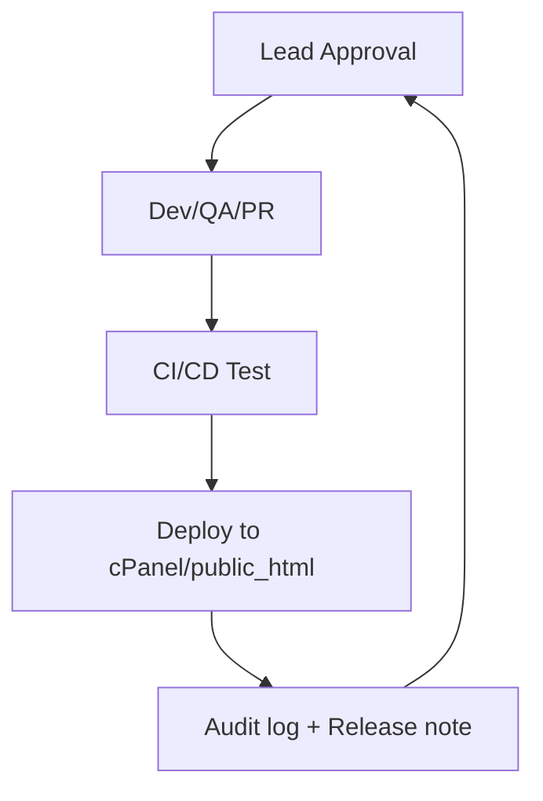

```markdown
# 🟩 Blackbox UI (AIG) – MASTERPROMPT v1.2

**Lead/Owner:** NEX  
**Udarbejdet:** 2025-06-30  
**Godkendt:** ALPHADEV  
**Projekt:** Blackbox UI – Blackbox E.Y.E  
**Status:** Autoritativ version til udvikling, QA, compliance, audit og drift.

---

## 1. Mission & Formål

- Gøre Blackbox UI (AIG) til enterprise-grade frontend og mission control for BLACKBOX.CODES.
- Alt udvikling, QA, compliance, deployment og audit sker efter denne manual.
- Manualen er bindende for alle deltagere – ingen undtagelser uden godkendelse fra NEX.

---

## 2. Agentroller og Adgang

| Rolle       | Rettigheder                                    | Forventninger                |
|-------------|------------------------------------------------|------------------------------|
| NEX         | Godkender alt, styrer releases, audit, security| Opsyn, endelig ansvar        |
| ALPHADEV    | Tech lead, CI/CD, pipeline, QA                 | Implementering, review       |
| IT-udvikler | Deployment, server, backup, pipeline           | Drift, automation            |
| QA-agent    | Test, compliance, audit trail, log-review      | Rapportering, sårbarhedstest |
| Agent       | Feature dev, dokumentation, mindre bugfix      | Følger workflow, rapporterer |

---

## 3. Struktur & Filhierarki

**Anbefalet projektstruktur:**
```

/.github/            # Workflows, issue templates, PR-templates
/assets/             # CSS, JS, billeder
/includes/           # PHP-inkluderinger
/docs/               # Blueprints, manual, API, policies
/docs/reports/       # Versionerede rapporter (status, sprint, audit, onboarding)
/tests/              # Tests
/logs/               # Audit/access logs (git-ignoreret)
ci.yml               # GitHub Actions pipeline
.gitignore
README.md
LICENSE
CHANGELOG.md
admin.php, dashboard.php, ...

````
- **/docs/** skal altid indeholde opdateret agentmanual, workflows og versionslog.
- **/logs/** holdes uden for git – kun nødvendigt til lokal/backup.

---

## 4. Commit- og Branchpolitik

- **main**: Kun stabil, deploybar kode via godkendte Pull Requests (PR).
- **dev**: Udvikling, bugfix, feature-branches merges hertil via PR.
- **feature/** og **hotfix/** branches for al ny kode/fejlrettelse.
- **PR’s:**  
  - Klar beskrivelse, test-case, referencer til issues/tasks.  
  - Ingen merges til main uden QA og CI-pass.

**Commit-format:**  
`type(scope): beskrivelse`  
Eksempel: `feat(login): Tilføj 2FA-support`

**CHANGELOG.md:**  
Opdateres ved merge til main (brug evt. conventional-changelog CLI).

---

## 5. CI/CD & Deploy

- **GitHub Actions**: Byg, test og deploy på alle PRs og på merge til main.
- **Deploy til cPanel/public_html:**  
    - Automatisk via SFTP/rsync fra Actions (SSH-key, env vars).
    - Manuelt kun hvis CI fejler.

**Eksempel på workflow (ci.yml) – KUN MED PLACEHOLDERS!**
```yaml
name: CI & Deploy

on:
  push:
    branches: [ main ]
  workflow_dispatch:

jobs:
  build:
    runs-on: ubuntu-latest
    steps:
      - uses: actions/checkout@v4
      - name: Lint README
        run: |
          if [ -f README.md ]; then
            echo "✅ README.md found!"
          else
            echo "❌ README.md missing!" >&2
            exit 1
          fi

  ftp-deploy:
    needs: build
    runs-on: ubuntu-latest
    if: github.ref == 'refs/heads/main'
    steps:
      - uses: actions/checkout@v4
      - name: Deploy via FTP
        uses: SamKirkland/FTP-Deploy-Action@v4.3.5
        with:
          server: ${{ secrets.FTP_HOST }}
          username: ${{ secrets.FTP_USERNAME }}
          password: ${{ secrets.FTP_PASSWORD }}
          protocol: ftp
          local-dir: ./
          server-dir: ${{ secrets.FTP_REMOTE_PATH }}
````

> **OBS:** **Credentials må aldrig lægges i workflows eller repo!**
> Brug altid `${{ secrets.FTP_HOST }}` osv. via GitHub “Secrets”.
> Se “Settings → Secrets and variables → Actions” på GitHub for at oprette/ændre secrets.

---

## 6. Sikkerhed, Logging & Compliance

* **Password hashing:** `password_hash()`, `password_verify()`.
* **DB:** Altid prepared statements (MySQLi/PDO).
* **Sessions:** Secure cookies, session\_start(), httpOnly.
* **Audit trail:** Log ALLE vigtige events til audit-log:

```
2025-06-30 13:12 | user=NEX | event=DEPLOY | ip=1.2.3.4
2025-06-30 13:17 | user=agentX | event=FAILED_LOGIN | agent_id=xyz | ip=7.7.7.7
```

* **GDPR:** Slet/brugerdata skal kunne anonymiseres/slettes via script.
* **Compliance-review:** QA-agent reviewer logs, changelog, deployments.

---

## 7. Dokumentation & QA

* **README.md:** Opdateres hver release, klar brugerguide, funktionsbeskrivelser.
* **/docs/**: Blueprint, policies, workflows, flowcharts, release notes.
* **/docs/reports/**: Versionerede rapporter (status, sprint, onboarding, audit)
* **CHANGELOG.md:** Semver, alle releases og større ændringer beskrives her.
* **QA log:** `/logs/qa/YYYY-MM/` – testresultater, compliance-checks.

---

## 8. PR-/Issue-Template

**.github/PULL\_REQUEST\_TEMPLATE.md**

```md
## Hvad ændres?
- [ ] Beskriv PR
- [ ] Issue/link

## Test & QA
- [ ] Funktion testet lokalt
- [ ] CI-pipeline passeret
- [ ] Dokumentation opdateret

## Compliance & Audit
- [ ] Nye moduler følger compliance-krav
- [ ] Auditlog opdateret
```

---

## 9. CLI-kommandoer (workflow)

```bash
git checkout dev
git pull origin dev
git checkout -b feature/ny-feature
# ... kodning ...
git add .
git commit -m "feat(modul): beskrivelse"
git push origin feature/ny-feature
# Lav PR til dev
# Efter QA merge til main via PR
```

---

## 10. Agentarbejdsgang (NEX/ALPHADEV/QA)

* **NEX:** Godkender releases, overvåger changelog, revision, compliance.
* **ALPHADEV:** Implementerer, reviewer, merger kun PR med QA-pass.
* **IT-udvikler:** Opsætter/vedligeholder pipeline, backups.
* **QA-agent:** Reviewer logs, tester deploy, rapporterer audit trail.
* **Agent:** Udvikler feature/bugfix, dokumenterer, følger manualen.

---

## 11. Compliance & Audit Logstruktur

* **QA logs:** `/logs/qa/YYYY-MM/`
* **Performance logs:** `/logs/performance/YYYY-MM/`
* **Audit trails:** `/logs/audit/YYYY-MM/` (CSV/JSON)
* **User feedback:** `/user_feedback/YYYY-MM/`
* **Incident logs:** `/logs/incident/YYYY-MM/`

---

## 12. Versionspolitik & Audit-krav

**ALPHADEV agenten SKAL versionere og dokumentere ALLE rapporter, statusfiler, sprintplaner og logs.**

* Hver leverance gemmes i `/docs/reports/` efter versioneret, audit-egnet filnavnsstandard.
* **Format:** `/docs/reports/v{X.Y}_YYYYMMDD_statusrapport.md`
* **Eksempel:** `/docs/reports/v1.2_20250630_statusrapport.md`
* Hver fil indeholder changelog, ansvarlig og versionsnummer – til audit og revision.
* Kun nyeste version er gyldig til review og compliance.
* ALPHADEV er ansvarlig for at ALLE leverancer følger denne standard.

---

## 13. CI/CD Security Policy

* **Credentials må ALDRIG ligge i repo, workflows eller dokumentation.**
* Al adgang til server, deploy eller eksterne systemer sker KUN via GitHub “Secrets” (Settings → Secrets and variables → Actions).
* **Eksempel på korrekt usage i workflow:**

  ```yaml
  server: ${{ secrets.FTP_HOST }}
  username: ${{ secrets.FTP_USERNAME }}
  password: ${{ secrets.FTP_PASSWORD }}
  ```
* Offentliggør ALDRIG keys, passwords eller følsomme oplysninger.

---

## 14. Blueprint-diagram (Mermaid)



---

## Instruks

“Hej ALPHADEV – følg ALLE flows, commit-politikker, review-processer, compliance-krav, versionspolitik og audit-logs som beskrevet her. Blueprint’et er bindende for drift, QA, release og deployment. Alle afvigelser SKAL dokumenteres i changelog og audit.”

---

**Denne masterprompt/manual SKAL gemmes i `/docs/` med versionsnummer i både filnavn og dokumentets indhold.  
Eksempel på filnavn:**  
`AIG_MASTERPROMPT_v1.2_20250630.md`  
> Opdater denne fil og versionsnummeret for hver ændring – behold ALLE gamle versioner i `/docs/` for audit og revision!

**[Seneste version: v1.2 | Dato: 2025-06-30 | Ansvarlig: NEX]**
